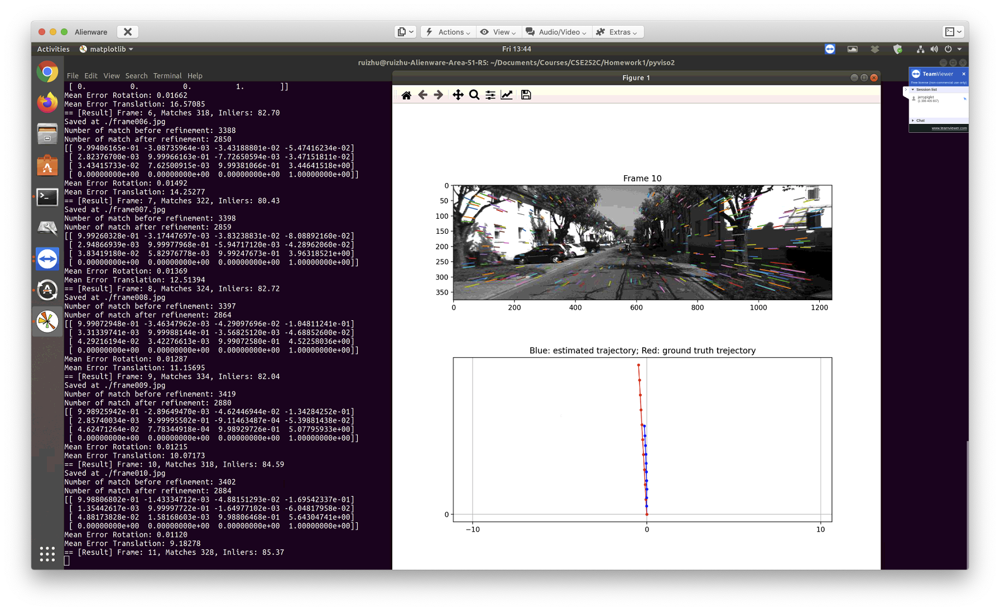
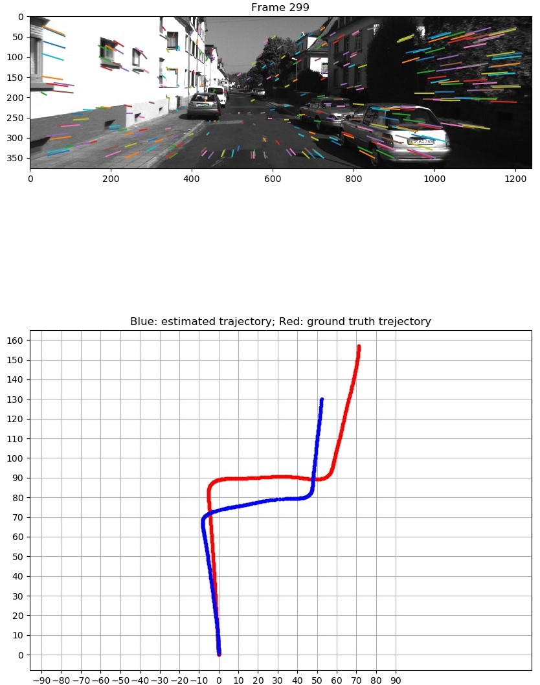
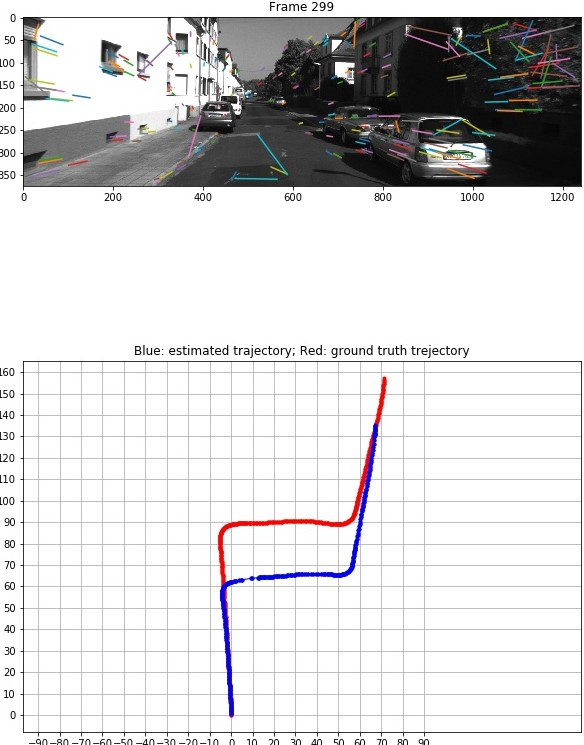
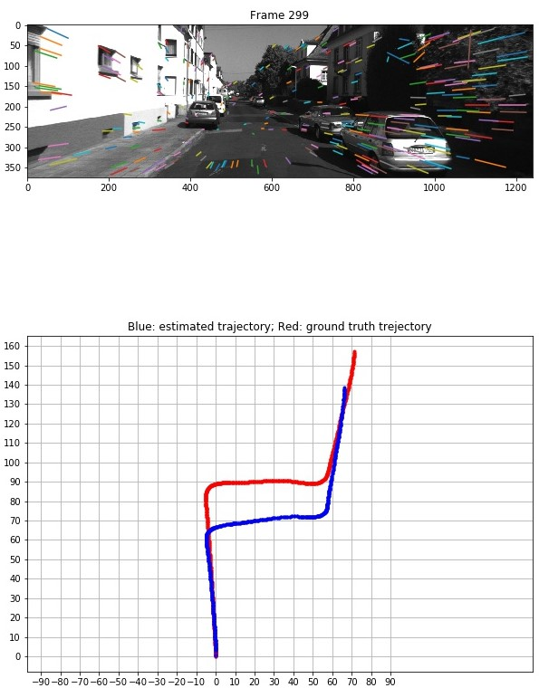
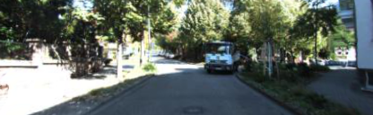

# Structure for Motion
The work is done as a project in CSE252C- Advanced Computer Vision at University of California - San Diego  
**Final Report is `Gaba_Satyam.pdf`**
## Getting Started
- Clone the repository
    - ``git clone https://github.com/SatyamGaba/structure_from_motion.git``
- Final Report is in the Jupyter Notebook ``sfm_analysis_final.ipynb``
- Follow the README (this file) for installation, data and compute instructions.

## Goal
The goal is to tract the trajectory of car motion using a camera (Monocular vision) placed on dashboard of a car. The idea is to obtain motion of the camera frame by frame and thus obtain the trajectory. To achieve this, we find keypoint correspondences using RANSAC algorithm between each consecutive frames and get the movement of car. Comparisions between various keypoints such as Harres Corner point(libviso2), SIFT, SuperPoint have been done. Deep Learning technique Spatial Pyramid Network (SPyNet) which uses Optical flow to obtain motion is done in part-4.   Unsupervised Learning using State-of-the-art Sfm-learner has been implemeneted in last part. A new photometric consistency loss has been introduced for unsupervised learning which shows improved in performance over the loss given in the paper. 

#### Implementation of the following papers/Libraries:
1. http://www.cvlibs.net/software/libviso/
2. David G Lowe. Distinctive image features from scale-invariant keypoints. IJCV, 60(2):91–110, 2004.
3. Daniel DeTone, Tomasz Malisiewicz, and Andrew Rabinovich. Superpoint: Self-supervised interest point detection and description. In Proceedings of the IEEE Conference on Computer Vision and Pattern Recognition Workshops, pages 224–236, 2018.
4. Anurag Ranjan and Michael J Black. Optical flow estimation using a spatial pyramid network. In Proceedings of the IEEE Conference on Computer Vision and Pattern Recognition, pages 4161–4170, 2017.
5. B. Kitt, A. Geiger, and H. Lategahn, “Visual odometry based on stereo image sequences with RANSAC-based outlier rejection scheme,” in 2010 IEEE Intelligent Vehicles Symposium, La Jolla, CA, USA, Jun. 2010, pp. 486–492, doi: 10.1109/IVS.2010.5548123
6. Tinghui Zhou, et al , "Unsupervised Learning of Depth and Ego-Motion from Video," in Proceedings of the IEEE Conference on Computer Vision and Pattern Recognition Workshops, 2017.

## Setting up the system

### 1. Installation instructions
#### 1.1 Set up the environment
##### 1.1.1 [Option 1] On your own machine
- (local) SSH into your machine
- Install SWIG
    - On Ubuntu: `sudo apt-get install swig` (sudo required)
    - On MacOS: `brew install swig`
        - You need to install Homebrew first with [HomeBrew](https://brew.sh/)
- Install Python 3.X and Pip
- [Recommended] Create an environment (e.g. with [Anaconda](https://docs.conda.io/en/latest/miniconda.html))
    - ``conda create --name py36 python=3.6 pip``
    - ``conda activate py36``
- Install Jupyter Notebook
    - ``conda install jupyter``
- Install kernels for Jupter Notebook
    - ``conda install nb_conda``
- Launch Jupyter Notebook server in the conda env of the cluster
    - `jupyter notebook`
    - You will be provided with a URL that you can open locally
    - In a opened notebook, change the kernel (on Menu: **Kernel** -> **Change Kernel**) to the name of the conda env you just created (in the case of this documentation it should be `py36`)
    
##### 1.1.2. [Option 2] On the ``ieng6.ucsd.edu`` server
- (local) **(IMPORTANT) Connect your [UCSD VPN](https://blink.ucsd.edu/technology/network/connections/off-campus/VPN/index.html)**
- (local) Login with your credentials
    - `ssh {USERNAME}@ieng6.ucsd.edu`
- If you cannot launch a pod, set up the environment following these [instructions](https://docs.google.com/document/d/e/2PACX-1vR-tC1oL6J9RJxSP42iWr8BukgRO9ohcybFXPn95yjQQLvv4iNP5Tlbzx06rQtPA-fLex2N_MVjzgAR/pub?embedded=true)
- Launch your pod. You should enter a node with 1 GPU
    - ``launch-scipy-ml.sh -i ucsdets/cse152-252-notebook:latest -g 1``
- You will be provided with a URL that you can open locally:
    
    - Click on the link. Then natigate to the jupyter notebook for a question which you are going to git clone as follows

#### 1.2. Pull the repo and install dependencies
- ``git clone https://github.com/SatyamGaba/structure_from_motion.git``
- Install dependencies (Python 3.X with Pip)
    - ``pip install -r requirements.txt --user``
- Compile and install `pyviso` for the SfM question
    - ``cd pyviso/src/``
    - ``pip install -e . --user``

### 2. Data
On the ``ieng6.ucsd.edu`` server, the datasets are located at
- Q1: SfM
    - `/datasets/cse152-252-sp20-public/dataset_SfM`
    - Change the dataset path in jupyter notebooks to your paths
    - Crate a Symbolic link to the dataset in local directory using: `ln -s /datasets/cse152-252-sp20-public/dataset_SfM .`
- Q5:
    - `/datasets/cse152-252-sp20-public/sfmlearner_h128w416`
    - `/datasets/cse152-252-sp20-public/kitti`

### 3. How to run
#### Q1: SfM - Working folder: `./pyviso`
##### Launch Jupyter Notebook
There is a ` sfm_analysis_final.ipynb` jupyter notebook file in the top-level directory `sfm`. 

##### Options
One toggle ``if_vis = True/False`` allows you to enable/disable the visualization. Disabling the visualization will make the for loop run significantly faster.

##### Output
The errors are printed and the visualizations are saved at ``vis/``. The images should look like:

To fetch the files you can use commands like `scp` to transfer files from the cluster to your local machine:

From your local machine: 

``scp -r <USERNAME>@dsmlp-login.ucsd.edu:/datasets/home/53/253/cs152sp20ta1/pyviso2/vis {LOCAL PATH}``

Or from within server if your local machine has a fixed address or IP:

``scp -r {REMOTE PATH TO THE vis FOLDER} <USERNAME>@<LOCAL ADDRESS>:{YOUR LOCAL PATH}``

#### Q4: Optical Flow - Working folder: `./opticalFlow`

### 4. [Extra] How to run training sessions

#### 4.1. Set up the environment

##### [Option 1] On the ``ieng6.ucsd.edu`` server

- Login with your credentials
    - `ssh {USERNAME}@ieng6.ucsd.edu`

-  Launch TMUX
    - Reconmended for session management: you can come back anytime after you disconnect your session. Otherwise you have to keep your connection on for hours while training.
    - Just run ``tmux``
    - To detach and come back later, use `ctrl + b` then `d`. To attach next time, use `ctrl + b` then `a`.
    - For more TMUX usages please refer to online tutorials like [https://linuxize.com/post/getting-started-with-tmux/](https://linuxize.com/post/getting-started-with-tmux/)

-  Launch your pod
    - Follow Section 1.1.2

##### [Option 2] On your own server
Just launch TMUX.

#### 4.2. Start training
Now you can create conda env and do your training in there following Section 1.1

## Results:
We have used "sequence 0" from KTTI Dataset for all experiments.  
The results of all experiments are summarized in the table below:

| Method     | Final Mean Rotation Error | Final Mean Rotation Error |
|   --       |    --                     |   --    |
| Libviso2   |                   0.00277 | 0.53721 |
| SIFT       |                   0.00243 | 0.55841 |
| SuperPoint |                   0.00369 | 0.52405 |
| SPyNet     |                   0.00372 | 0.79390 |

#### Libviso2:

#### SIFT:

#### SuperPoint:

#### SPyNet:

#### Sfm Learner:
* Warped Image:

* Depth Map:

Error metrics used: Absolute Translation Error (ATE) and Rotational Error (RE).
##### Simple SfmLearner Model (3 losses) after training for 200 epochs
* Performance on sequence 09:

|       | ATE  |  RE  |
| ---   | ---  | ---  |
| mean  |0.0119|0.0023|
| std   |0.0065|0.0012|

* Performance on sequence 10:

|          |     ATE  |     RE    |
|   ---    |    --    |     --    |
|mean      |   0.0108 |    0.0024 |
|std       |  0.0084  |   0.0016  |

##### SfmLearner Model with Photoconsistency Loss (4 losses) after training for 200 epochs
* Performance on sequence 09: 

|          |  ATE   |   RE    |
|  ---     |  --    |   --    |
|   mean   | 0.0128 |   0.0024|
|   std    | 0.0074 |   0.0013|

* Performance on sequence 10:

|          |   ATE    |    RE   |
|   --     |    --    |   --    |
|mean      |   0.0098 |  0.0025 |
|std       |   0.0071 |  0.0017 |

## References:
1. Daniel DeTone, Tomasz Malisiewicz, and Andrew Rabinovich. Superpoint: Self-supervised interest point detection and description. In Proceedings of the IEEE Conference on Computer Vision and Pattern Recognition Workshops, pages 224–236, 2018.
2. Andreas Geiger, Philip Lenz, and Raquel Urtasun. Are we ready for autonomous driving? the kitti vision benchmark suite. In Conference on Computer Vision and Pattern Recognition (CVPR), 2012.
3. Andreas Geiger, Julius Ziegler, and Christoph Stiller. Stereoscan: Dense 3d reconstruction in real-time. In Intelligent Vehicles Symposium (IV), 2011.
4. David G Lowe. Distinctive image features from scale-invariant keypoints. IJCV, 60(2):91–110, 2004.
5. Anurag Ranjan and Michael J Black. Optical flow estimation using a spatial pyramid network. In
Proceedings of the IEEE Conference on Computer Vision and Pattern Recognition, pages 4161–4170, 2017.
6. A. Vedaldi and B. Fulkerson. VLFeat: An open and portable library of computer vision algorithms. http://www.vlfeat.org/, 2008.
7. Lucas, Bruce D., and Takeo Kanade. "An iterative image registration technique with an application to stereo vision." (1981): 674.
8. B. Kitt, A. Geiger, and H. Lategahn, “Visual odometry based on stereo image sequences with RANSAC-based outlier rejection scheme,” in 2010 IEEE Intelligent Vehicles Symposium, La Jolla, CA, USA, Jun. 2010, pp. 486–492, doi: 10.1109/IVS.2010.5548123.
9. A. Geiger, J. Ziegler, and C. Stiller, “StereoScan: Dense 3d reconstruction in real-time,” in 2011 IEEE Intelligent Vehicles Symposium (IV), Baden-Baden, Germany, Jun. 2011, pp. 963–968, doi: 10.1109/IVS.2011.5940405.
