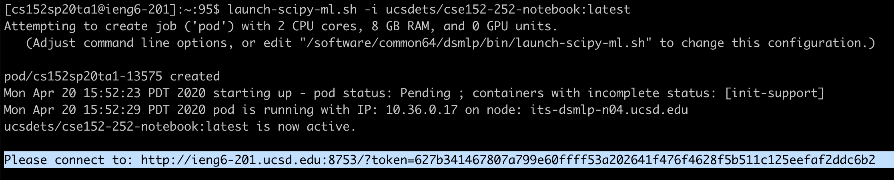

# CSE152B HW1 - SfM with libviso2

## 1. Installation instructions
### 1. Set up the environment
#### 1. [Option 1] On your own machine
- (local) SSH into your machine
- Install SWIG
    - On Ubuntu: `sudo apt-get install swig` (sudo required)
    - On MacOS: `brew install swig`
        - You need to install Homebrew first with [HomeBrew](https://brew.sh/)
- Install Python 3.X and Pip
- [Recommended] Create an environment (e.g. with [Anaconda](https://docs.conda.io/en/latest/miniconda.html))
    - ``conda create --name py36 python=3.6 pip``
    - ``conda activate py36``
- Install Jupyter Notebook
    - ``conda install jupyter``
- Install kernels for Jupter Notebook
    - ``conda install nb_conda``
- Launch Jupyter Notebook server in the conda env of the cluster
    - `jupyter notebook`
    - You will be provided with a URL that you can open locally
    - In a opened notebook, change the kernel (on Menu: **Kernel** -> **Change Kernel**) to the name of the conda env you just created (in the case of this documentation it should be `py36`)
    
#### 2. [Option 2] On the ``ieng6.ucsd.edu`` server
- (local) Connect your [UCSD VPN](https://blink.ucsd.edu/technology/network/connections/off-campus/VPN/index.html)
- (local) Login with your credentials
    - `ssh {USERNAME}@ieng6.ucsd.edu`
- Launch your pod. You should enter a node with 1 GPU
    - ``launch-scipy-ml.sh -i ucsdets/cse152-252-notebook:latest``
- You will be provided with a URL that you can open locally:
    
    - Click on the link. Natigate to the Jupyter notebook for a question (e.g. pyviso2/demo_viso_mono.ipynb)
<!-- - Create an environment with conda
    - ``conda create --name py36 python=3.6 pip``
    - ``conda activate py36``
        - If you see errors activating the env, follow the information on screen by typing `conda init bash`, `exit` and again ``launch-scipy-ml-gpu.sh``, then ``conda activate py36``
- Install SWIG
    - ``conda install swig`` -->

    
### 2. Pull the repo and install dependencies
- ``git clone https://github.com/Jerrypiglet/pyviso2-SfM.git``
- Install dependencies (Python 3.X with Pip)
    - ``pip install -r requirements.txt``
- Compile and install pyviso
    - ``cd src/``
    - ``pip install -e .``

## 2. Get the data
Change the dataset path in Line 26 to your paths. 

On the ``ieng6.ucsd.edu`` server, the dataset is located at `/datasets/cse152-252-sp20-public/dataset_SfM`.

## 3. How to run

### Launch Jupyter Notebook
<!-- ``python demo_viso_mono.py`` -->
There are 3 `*.ipynb` jupyter notebook files in  `pyviso2/`. 

### Options
One toggle in Line 22 ``if_vis = True/False`` allows you to enable/disable the visualization. Disabling the visualization will make the for loop run significantly faster.
<!-- , and to specify if the visualization will be display on screen or saved in the background.**

If  and ``if_on_screen == True``,  -->

### Outputs
The errors are printed and the visualizations are saved at ``vis/``. The images should look like:

To fetch the files you can use commands like `scp` to transfer files from the cluster to your local machine:

From your local machine: 

``scp -r <USERNAME>@dsmlp-login.ucsd.edu:/datasets/home/53/253/cs152sp20ta1/pyviso2/vis {LOCAL PATH}``

Or from within server if your local machine has a fixed address or IP:

``scp -r {REMOTE PATH TO THE vis FOLDER} <USERNAME>@<LOCAL ADDRESS>:{YOUR LOCAL PATH}``

## 4. [Extra] How to run training sessions

### 1. Set up the environment

#### [Option 1] On the ``ieng6.ucsd.edu`` server

- Login with your credentials
    - `ssh {USERNAME}@ieng6.ucsd.edu`

-  Launch TMUX
    - Reconmended for session management: you can come back anytime after you disconnect your session. Otherwise you have to keep your connection on for hours while training.
    - Just run ``tmux``
    - To detach and come back later, use `ctrl + b` then `d`. To attach next time, use `ctrl + b` then `a`.
    - For more TMUX usages please refer to online tutorials like [https://linuxize.com/post/getting-started-with-tmux/](https://linuxize.com/post/getting-started-with-tmux/)

-  Launch your pod
    - `launch-scipy-ml-gpu.sh`

#### [Option 2] On your own server
Just launch TMUX.

### 2. Start training
Now you can create conda env and do your training in there following Section 1.1

